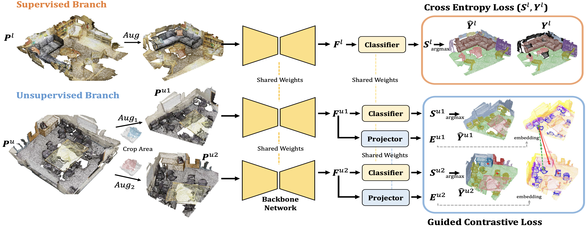

# GuidedContrast
## Guided Point Contrastive Learning for Semi-supervised Point Cloud Semantic Segmentation (ICCV 2021)



Code for the paper [**Guided Point Contrastive Learning for Semi-supervised Point Cloud Semantic Segmentation**](https://arxiv.org/abs/2110.08188), ICCV 2021.

**Authors**: Li Jiang, Shaoshuai Shi, Zhuotao Tian, Xin Lai, Shu Liu, Chi-Wing Fu, Jiaya Jia

## Introduction
Rapid progress in 3D semantic segmentation is inseparable from the advances of deep network models, which highly rely on large-scale annotated data for training. To address the high cost and challenges of 3D point-level labeling, we present a method for semi-supervised point cloud semantic segmentation to adopt unlabeled point clouds in training to boost the model performance. Inspired by the recent contrastive loss in self-supervised tasks, we propose the guided point contrastive loss to enhance the feature representation and model generalization ability in semi-supervised setting. Semantic predictions on unlabeled point clouds serve as pseudo-label guidance in our loss to avoid negative pairs in the same category. Also, we design the confidence guidance to ensure high-quality feature learning. Besides, a category-balanced sampling strategy is proposed to collect positive and negative samples to mitigate the class imbalance problem. 

## Installation

### Prerequisites
* Python 3.8.0
* Pytorch 1.11.0
* CUDA 11.2

### Install `GuidedContrast`
(1) Build the virtual environment.
```
conda create -n gpcl python==3.8
conda activate gpcl
```

(2) Install PyTorch following the [official instructions](https://pytorch.org/). For example,
```
conda install pytorch=1.11 torchvision torchaudio cudatoolkit=11.3 -c pytorch
```

(3) Clone this repository.
```
git clone https://github.com/llijiang/GuidedContrast.git 
cd GuidedContrast
```

(4) Install the dependent libraries.
```
pip install -r requirements.txt
conda install -c bioconda google-sparsehash 
```

(5) Build GuidedContrast.
```
cd lib
python setup.py install
```

## Data Preparation

### ScanNet
(1) Download the [ScanNet](http://www.scan-net.org/) v2 dataset.

(2) Generate processed data files.
```
cd dataset/scannetv2
python prepare_data.py --split [train/val/test] --scannet_path /path/to/ScanNet
```

(3) The data files should be organized as follows.
```
GuidedContrast
├── dataset
│   ├── scannetv2
│   │   ├── train
│   │   │   ├── scene[04d]_[02d].pth
│   │   ├── val
│   │   │   ├── scene[04d]_[02d].pth
│   │   ├── test
│   │   │   ├── scene[04d]_[02d].pth
```

### S3DIS
(1) Download the [S3DIS](https://docs.google.com/forms/d/e/1FAIpQLScDimvNMCGhy_rmBA2gHfDu3naktRm6A8BPwAWWDv-Uhm6Shw/viewform?c=0&w=1) dataset.

(2) Unzip `Stanford3dDataset_v1.2_Aligned_Version.zip`.

(3) Generate processed data files.
```
cd dataset/s3dis
python prepare_data.py --s3dis_path /path/to/Stanford3dDataset_v1.2_Aligned_Version
```

(4) The data files should be organized as follows.
```
GuidedContrast
├── dataset
│   ├── s3dis
│   │   ├── s3dis
│   │   │   ├── [area]_[room].pth
```

### SemanticKITTI
(1) Download the [SemanticKITTI](http://www.semantic-kitti.org/dataset.html#download) dataset.

(2) The data files should be organized as follows.
```
GuidedContrast
├── dataset
│   ├── semantic_kitti
│   │   ├── sequences
│   │   │   ├── 00 ~ 21 (00 ~ 10 has labels)
│   │   │   │   ├── calib.txt 
│   │   │   │   ├── times.txt 
│   │   │   │   ├── velodyne 
│   │   │   │   │   ├── [06d].bin
│   │   │   │   ├── labels 
│   │   │   │   │   ├── [06d].label
│   │   │   │   ├── poses.txt 
```

## Training
### ScanNet / S3DIS
```
python train.py --config config/[dataset]/semseg_run1_[split]_[semi/baseline]_[dataset].yaml
```
For example, to train a semi-supervised model on ScanNet with 5% labeled data, 
```
python train.py --config config/scannet/semseg_run1_5_semi_scannet.yaml
```

### SemanticKITTI
First, pre-train a network on the labeled set,
```
python train.py --config config/semantic_kitti/semseg_run1_[split]_pretrain_semantickitti.yaml
```
Then, train the semi-supervised / supervised-only models,
```
python train.py --config config/semantic_kitti/semseg_run1_[split]_[semi/baseline]_semantickitti.yaml 
```

### Multi-GPU Training
```
CUDA_VISIBLE_DEVICES=0,1,2,3  bash train.sh 4 --config [config_file]
```

## Inference and Evaluation
* For single-GPU testing,
```
python test.py --config [config_file] 
```
* For multi-GPU testing,
```
CUDA_VISIBLE_DEVICES=0,1 bash test.sh 2 --config [config_file] 
```
* To specify a model for testing, 
```
python test.py --config [config_file] --pretrain [pretrain_model_path]
```
* To specify an iteration for testing,
```
python test.py --config [config_file] --set test_iter [test_iter]
```

## Models
Models trained with this repo are listed below (metric: mIoU). Four GPUs are applied in training.

### ScanNet
|          |   5%   |  10%  |  20%  |  30%  |  40%  |                                              Models                                              |
|:--------:|:------:|:-----:|:-----:|:-----:|:-----:|:------------------------------------------------------------------------------------------------:|
| Sup-only | 49.13  | 58.01 | 64.30 | 67.05 | 69.44 | [download](https://drive.google.com/drive/folders/1Cnv5B8z1u1RAD_gbIhCqsobywV8VzSNk?usp=sharing) |
| Semi-sup | 55.42  | 62.17 | 67.02 | 69.46 | 71.50 | [download](https://drive.google.com/drive/folders/1wsnFks8TiJjZrgnpoJBS1rHvuk3nhIfs?usp=sharing) |

### S3DIS
|          |  5%   |  10%  |  20%  |  30%  |  40%  |                                              Models                                              |
|:--------:|:-----:|:-----:|:-----:|:-----:|:-----:|:------------------------------------------------------------------------------------------------:|
| Sup-only | 45.73 | 53.39 | 58.34 | 61.41 | 61.69 | [download](https://drive.google.com/drive/folders/1YXgDC68FmwCbihJdYso67Bfh4M1sxYct?usp=sharing) |
| Semi-sup | 53.20 | 56.64 | 63.67 | 64.95 | 65.32 | [download](https://drive.google.com/drive/folders/17j0oox0xeVdIR9rH2NMgWeSEC5SJSRBw?usp=sharing) |

### SemanticKITTI
|          |  5%   |  10%  |  20%  |  30%  |  40%  |                                              Models                                              |
|:--------:|:-----:|:-----:|:-----:|:-----:|:-----:|:------------------------------------------------------------------------------------------------:|
| Sup-only | 35.64 | 42.68 | 53.98 | 55.30 | 57.20 | [download](https://drive.google.com/drive/folders/1VtiRUb2ckvOWpQxNW1aTlxQMV0-HnJcu?usp=sharing) |
| Semi-sup | 42.45 | 48.77 | 58.78 | 59.26 | 59.96 | [download](https://drive.google.com/drive/folders/1TR7BfvVlKm_gFi4YqbUrv6Uy-6pdBW7f?usp=sharing) |


## Citation
If you find this work useful in your research, please cite:
```
@inproceedings{jiang2021guided,
  title={Guided point contrastive learning for semi-supervised point cloud semantic segmentation},
  author={Jiang, Li and Shi, Shaoshuai and Tian, Zhuotao and Lai, Xin and Liu, Shu and Fu, Chi-Wing and Jia, Jiaya},
  booktitle={Proceedings of the IEEE/CVF International Conference on Computer Vision},
  year={2021}
}
```

## Acknowledgement
This repo is built upon several repos, e.g., [SparseConvNet](https://github.com/facebookresearch/SparseConvNet), [spconv](https://github.com/traveller59/spconv) and [ScanNet](https://github.com/ScanNet/ScanNet). 

## Contact
If you have any questions or suggestions about this repo, please feel free to contact me (lijiang@mpi-inf.mpg.de).


